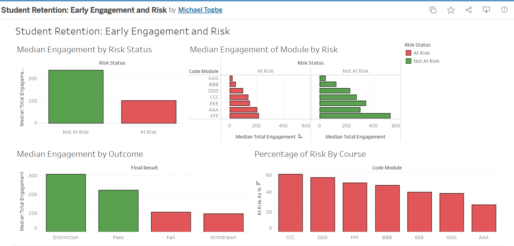

# Student Retention Insights Dashboard

This project explores the Open University Learning Analytics Dataset (OULAD) to surface patterns and insights relevant to student retention.
The question it aims to answer: is early student engagement (or other factors) a useful sign for predicting students at risk of failing or withdrawing from a course?

## Data
The Open University Learning Analytics Dataset (OULAD) is based on UK Open University data (2013-2014) covering student engagement, assessment results, demographics, and socioeconomic indicators. 
download OULAD from kaggle: https://www.kaggle.com/datasets/anlgrbz/student-demographics-online-education-dataoulad?resource=download
Once downloaded, extract the files so the CSVs sit in a desired location

## Setup
1. Create and activate a Python virtual environment.
2. Install dependencies: `pip install duckdb pandas`
3. Open `scripts/load_data.py` and set the CSV file paths to match where your data (OULAD csv files) lives.
4. Run the script to load all OULAD tables into a local DuckDB database.

## Project structure

`scripts/` - scripts to load the OULAD data into DuckDB
`sql/` - SQL queries against the loaded data
`notes/` - documentation on project decisions and EDA  

progress(09/18/26): The data loads and the analysis table for tableau has been built. 

## Findings 
Analysis focused on early engagement window (0-28 days of each course/module)
1. At risk students (failed or withdrew) engaged about half as much as not at risk students (Pass or Disitinction). Median early engagement was roughly 100 clicks for at risk students and over 200 for not at risk students. This 2:1 gap still holds for the average.
2. Engagement formed a clear gradient, with Distinction students engaged the most, followed by Pass, Fail, and Withdrawn. Better outcomes consistently correlate with higher engagement.
3. The engagement gap between at-risk and not-at-risk students held across nearly all course modules which suggests that the pattern is not driven by a single course.
4. At-risk rates vary widely by course, from about 27% (AAA) to 60% (CCC), so risk is concentrated in certain modules rather than spread evenly.

Actionable finding: Because early engagement separates at risk and not at risk students, and risk concentrates in specific courses/modules, an insitiution could flag low early engagement students for outreach during the first month, prioritizing the highest risk modules.

Tableau Dashboard: https://public.tableau.com/app/profile/michael.togbe/viz/StudentRetentionEarlyEngagementandRisk/StudentRetentionEarlyEngagementandRisk?publish=yes

